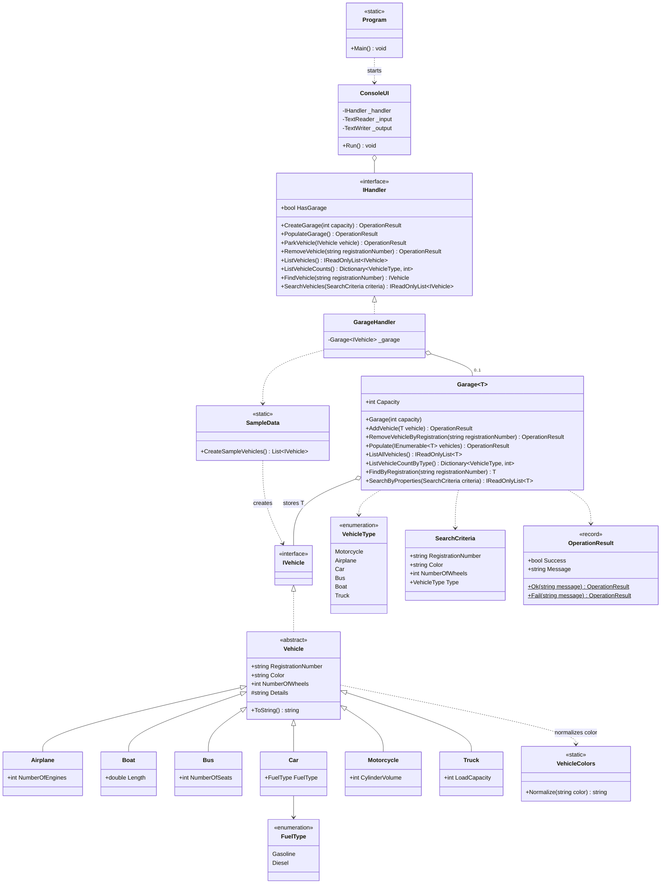

# Garage 2.0 - UML class diagram

```mermaid
classDiagram
	direction TB

	class IVehicle {
		<<interface>>
	}

	class Vehicle {
		<<abstract>>
		+string RegistrationNumber
		+string Color
		+int NumberOfWheels
		#string Details
		+ToString() string
	}

	class Airplane {
		+int NumberOfEngines
	}
	class Boat {
		+double Length
	}
	class Bus {
		+int NumberOfSeats
	}
	class Car {
		+FuelType FuelType
	}
	class Motorcycle {
		+int CylinderVolume
	}
	class Truck {
		+int LoadCapacity
	}

	class VehicleType {
		<<enumeration>>
		Motorcycle
		Airplane
		Car
		Bus
		Boat
		Truck
	}

	class FuelType {
		<<enumeration>>
		Gasoline
		Diesel
	}

	class VehicleColors {
		<<static>>
		+Normalize(string color) string
	}

	class SampleData {
		<<static>>
		+CreateSampleVehicles() List~IVehicle~
	}

	class Garage~T~ {
		+int Capacity
		+Garage(int capacity)
		+AddVehicle(T vehicle) OperationResult
		+RemoveVehicleByRegistration(string registrationNumber) OperationResult
		+Populate(IEnumerable~T~ vehicles) OperationResult
		+ListAllVehicles() IReadOnlyList~T~
		+ListVehicleCountByType() Dictionary~VehicleType, int~
		+FindByRegistration(string registrationNumber) T
		+SearchByProperties(SearchCriteria criteria) IReadOnlyList~T~
	}

	class SearchCriteria {
		+string RegistrationNumber
		+string Color
		+int NumberOfWheels
		+VehicleType Type
	}

	class OperationResult {
		<<record>>
		+bool Success
		+string Message
		+Ok(string message)$ OperationResult
		+Fail(string message)$ OperationResult
	}

	class IHandler {
		<<interface>>
		+bool HasGarage
		+CreateGarage(int capacity) OperationResult
		+PopulateGarage() OperationResult
		+ParkVehicle(IVehicle vehicle) OperationResult
		+RemoveVehicle(string registrationNumber) OperationResult
		+ListVehicles() IReadOnlyList~IVehicle~
		+ListVehicleCounts() Dictionary~VehicleType, int~
		+FindVehicle(string registrationNumber) IVehicle
		+SearchVehicles(SearchCriteria criteria) IReadOnlyList~IVehicle~
	}

	class GarageHandler {
		-Garage~IVehicle~ _garage
	}

	class ConsoleUI {
		-IHandler _handler
		-TextReader _input
		-TextWriter _output
		+Run() void
	}

	class Program {
		<<static>>
		+Main() void
	}

	IVehicle <|.. Vehicle
	Vehicle <|-- Airplane
	Vehicle <|-- Boat
	Vehicle <|-- Bus
	Vehicle <|-- Car
	Vehicle <|-- Motorcycle
	Vehicle <|-- Truck

	Car --> FuelType
	Vehicle ..> VehicleColors : normalizes color
	SampleData ..> IVehicle : creates
	Garage~T~ o-- IVehicle : stores T
	Garage~T~ ..> SearchCriteria
	Garage~T~ ..> OperationResult
	Garage~T~ ..> VehicleType

	IHandler <|.. GarageHandler
	GarageHandler o-- "0..1" Garage~IVehicle~
	GarageHandler ..> SampleData
	ConsoleUI o-- IHandler
	Program ..> ConsoleUI : starts
```
